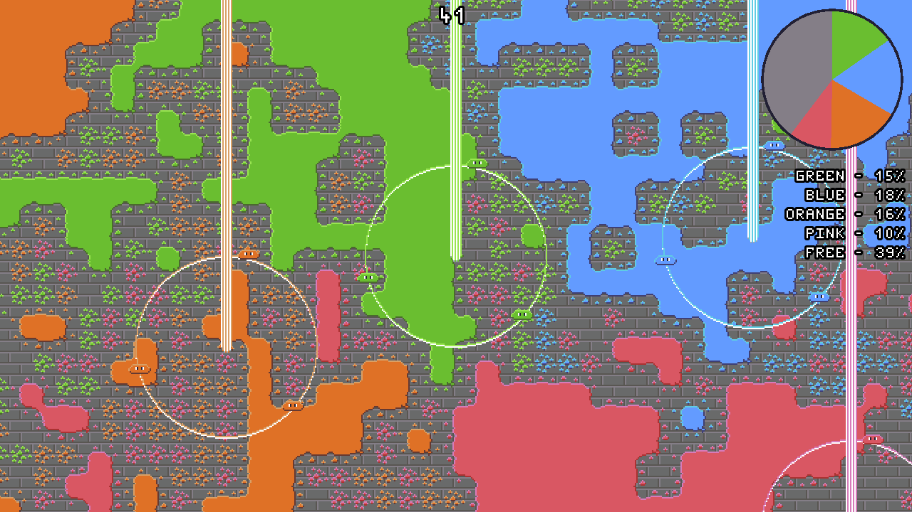

# Blobs of Colour
A game about filling a hall with colour in 99 seconds while competing with 3 opponents.

Made for [#Minijam 62](https://itch.io/jam/mini-jam-62) (Theme: Colours, Limitation: All animations must use 2 frames).

## How to play
- Your slimes ("blobs") paint tiles they move over.
- Fill as much of the floor with your colour as possible.
- Having a square of four tiles filled with your colour doubles the score of those tiles. They will visibly connect.
- Destroy your opponent's colour fields by running over them.

## Controls
Supported movement methods:

- WASD or Arrow Keys
- Mouse
- Gamepad

Toggle fullscreen by pressing F11 or Select on your Gamepad.

## Getting the game
You have the following options:

- Get it from [itch.io](https://nalquas.itch.io/blobs-of-colour)
- Get it from [the GitHub release page](https://github.com/nalquas/blobs-of-colour/releases)
- Build it yourself by running `make` in this directory, assuming you have Godot 3.2 installed.

## Installation instructions
Extract the downloaded .zip somewhere to install the game. Start it by running the executable.
